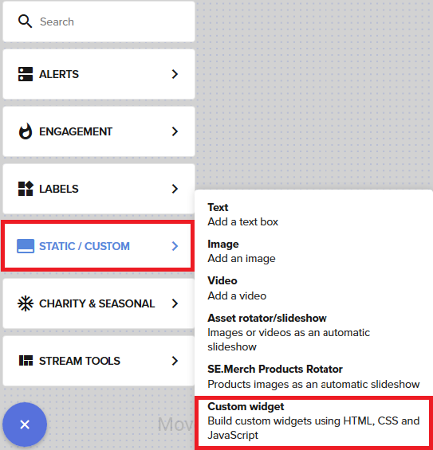
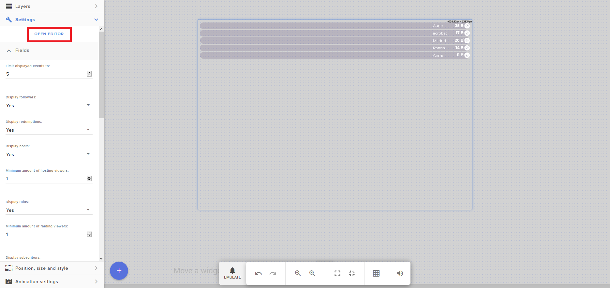

# Credits End
Stream Elements overlay widget displaying information about subs, followers, cheers and tips.

## Feature request
[New request](https://github.com/xPremiix/credits_end/issues/new)
- Custom strings for displaying usernames
- username alignment

## Bugs
- Delayed update of checkboxes (display of subs/followers/tips/cheers)
- Fix users being shown multiple times per type. e.g. being shown twice for subscribing for two months

## Installation
<ol>
    <li>
    
Insert new custom widget as shown below

    
    </li>
    <li>
        
Then click on the widget, select settings and open editor

        
    </li>
    <li>
        
Paste the contents of the files into the appropriate tabs

        <ul>
            <li>content of `widget.html` goes into the html tab</li>
            <li>content of `widget.css` goes into the css tab</li>
            <li>content of `widget.js` goes into the js tab</li>
            <li>content of `widget.json` goes into the fields tab</li>
            <li>Click done</li>
        </ul>
        
    </li>
</ol>
